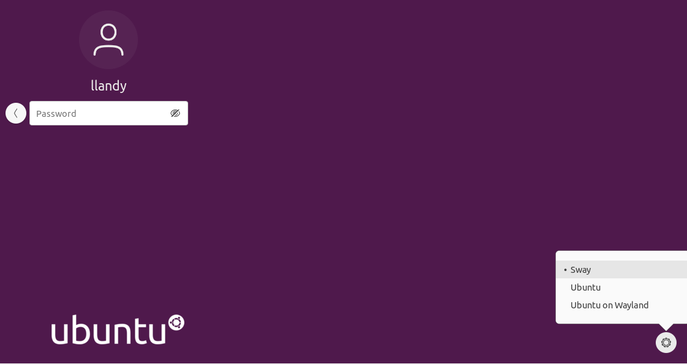
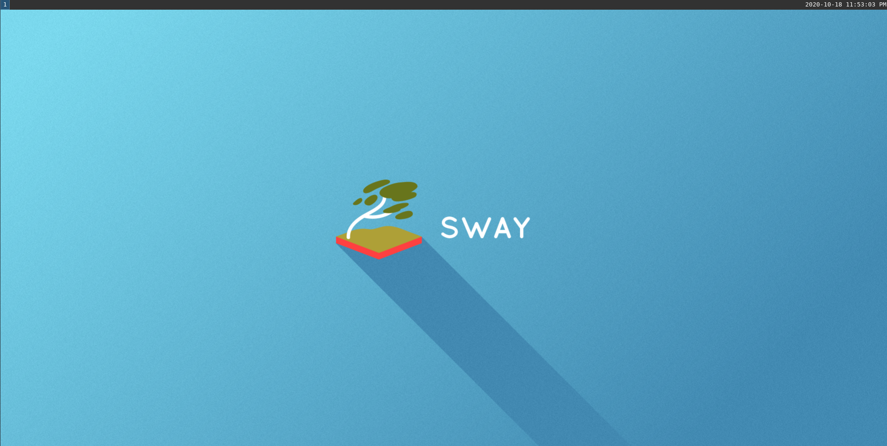

# Simple Install 22.04

Install seatd, wlroots and sway from source.

## Introduction

In this section we are going to build [seatd](https://git.sr.ht/~kennylevinsen/seatd), [wlroots](https://github.com/swaywm/wlroots) (required to build sway) and [sway](https://github.com/swaywm/sway) from the source repository.

We will be building the latest development version.

## Apt install (Optional)

If you prefer to avoid building things from source and you don't necessarily want the latest shiny version you can install sway via apt:

```sh
sudo apt install sway
```

You can then proceed reading from the [desktop file section](#desktop-file).

## Build seatd

Here we will be building and installing seatd.

### Dependencies

Start by installing the essentials tools, we will be using pip to install an updated version of meson.

```
sudo apt install build-essential
sudo apt install git
sudo apt install python3-pip
```

---

**Meson**

We need a specific version of [meson](https://mesonbuild.com/) that will work with our ubuntu library version, we will be using pip to install it.

```sh
pip3 install --user meson==0.61.2
```

We now need this to be available under PATH:
```
export PATH=$HOME/.local/bin:$PATH
```

Add the line at the end of your `.bashrc` in your home and source it:
```
source ~/.bashrc
```

---

Next install the libraries:


```
sudo apt install ninja-build meson
```

### Build & Install

Now we will be cloning, building and installing seatd.

**Clone the repo**

You can choose the path you prefer for the following steps, I will be working in `~/sway-build`.
```
mkdir ~/sway-build
cd ~/sway-build
git clone https://git.sr.ht/~kennylevinsen/seatd
cd seatd
```

**Build seatd**
```sh
# ~/sway-build/seatd
meson build
ninja -C build
```

**Install seatd**
```sh
# ~/sway-build/seatd
sudo ninja -C build install
```

And that's it, with this you have successfully installed seatd.

## Build wlroots

Here we will be building and installing wlroots.

### Dependencies

Next are direct dependencies of wlroots:

```sh
sudo apt install wayland-protocols \
libwayland-dev \
libegl1-mesa-dev \
libgles2-mesa-dev \
libdrm-dev \
libgbm-dev \
libinput-dev \
libxkbcommon-dev \
libgudev-1.0-dev \
libpixman-1-dev \
libsystemd-dev \
cmake \
libpng-dev \
libavutil-dev \
libavcodec-dev \
libavformat-dev
```

The next ones are optional dependencies for x11 support, not required if you want a full wayland installation.

By default Ubuntu 22.04 is using wayland so you can skip these:

```
sudo apt install libxcb-composite0-dev \
        libxcb-icccm4-dev \
        libxcb-image0-dev \
        libxcb-render0-dev \
        libxcb-xfixes0-dev \
        libxkbcommon-dev \
        libxcb-xinput-dev \
        libx11-xcb-dev
```

### Build & Install

Now we will be cloning, building and installing wlroots.

**Clone the repo**

We will be using the path created in the seatd steps:

```
# ~/sway-build
git clone https://gitlab.freedesktop.org/wlroots/wlroots.git
cd wlroots
```

**Build wlroots**
```sh
# ~/sway-build/wlroots
meson build
ninja -C build
```

**Install wlroots**
```sh
# ~/sway-build/wlroots
sudo ninja -C build install
```

And that's it, with this you have successfully installed wlroots.

## Build Sway

Here we will be building and installing Sway.

### Dependencies

The list of what we need now is smaller:

```sh
sudo apt install libjson-c-dev \
libpango1.0-dev \
libcairo2-dev \
libgdk-pixbuf2.0-dev \
scdoc
```

### Build & Install

Now we will be cloning, building and installing sway.

**Clone the repo**

We will be using the path created in the seatd steps:
```
# ~/sway-build
git clone https://github.com/swaywm/sway.git
cd sway
```

**Build sway**
```sh
# ~/sway-build/sway
meson build
ninja -C build
```

**Install sway**
```sh
# ~/sway-build/sway
sudo ninja -C build install
```

That's it you just installed Sway! 🎉

## Sanity Checks & Post Install

### Desktop File

You should have this file `/usr/local/share/wayland-sessions/sway.desktop` with these contents:
```
[Desktop Entry]
Name=Sway
Comment=An i3-compatible Wayland compositor
Exec=sway
Type=Application
```

This file is what allows the login manager to select the environment Sway to start at login.

A neat trick is that you can **Exec** a custom script that sets some environment variables or does something else before starting sway, but we will see other ways to set these variables in further parts of the guide.

**note:** if you installed via `apt` this should be located in `/usr/share/wayland-sessions/sway.desktop`

### Config File

You can copy the default sway config from `/usr/local/etc/sway/config` to `~/.config/sway/config`:
```
mkdir ~/.config/sway
cp /usr/local/etc/sway/config ~/.config/sway
```

This is the file you will be modifying to customize the sway behaviour and keybinds.

**note:** if you have an i3 config, you can copy that in the same path as above instead of the default one and it should work.

**note:** if you installed via `apt` this should be located in `/etc/sway/config`

### Final dependencies

**Whaaat ?? More dependencies ???**

Bear with me, the default config expects some programs for some of its configuration, they can be changed but to make it work let's just install them and later we will see replacements.

The missing deps are:

* **dmenu**: default menu when using `<mod>+d`
* **swaybg**: allows sway to handle background images
* **swayidle**: allows sway to handle idle functionality
* **swaylock**: locks the screen
* **alacritty**: default terminal emulator in sway

You can install them with:
```
sudo apt install dmenu
sudo apt install swaybg
sudo apt install swayidle
sudo apt install swaylock
```

For alacritty, please see the [alacritty optional section below](#alacritty-optional) before trying sway.

---

**Idle behaviour**

You might want to uncomment this exec from the default config to have the idle behaviour you expect of screen locking and screen turn off:
```
### Idle configuration
#
# Example configuration:
#
# exec swayidle -w \
#          timeout 300 'swaylock -f -c 000000' \
#          timeout 600 'swaymsg "output * dpms off"' resume 'swaymsg "output * dpms on"' \
#          before-sleep 'swaylock -f -c 000000'
#
# This will lock your screen after 300 seconds of inactivity, then turn off
# your displays after another 300 seconds, and turn your screens back on when
# resumed. It will also lock your screen before your computer goes to sleep.
```

In a later section of the guide we will see how to have a custom behaviour to blur the screen on lock, a totally useless thing but definitely neat.

## Start Sway

Now we can finally start sway!

Logout and in the bottom right widget on login select Sway and proceed to login: 


You will be greeted by a pretty empty but clean virtual desktop:


To exit Sway you can press the keys `<mod>+shift+e` that will bring up a popup where you will have to click with the mouse to confirm:


Now you can experiment with Sway to see if it fits your workflow, with the default config you can use these commands to open a new terminal and close windows:

* `<mod>+enter` - Open a new terminal
* `<mod>+shift+q` - Close window
* `<mod>+d` - Open dmenu


Great! This concludes the simple install of Sway, if you are interested in some tools and configurations that I find useful for my day to day work, check the [Extra](../extra.md) section!

I hope you will enjoy this new workflow as much as I do, and if you do not, you learned something new today!

## Alacritty (Optional)

### TODO: doesn't seem like there is a simple way to get alacritty yet, possibly cargo but not advisable to require that... needs more research

The default terminal in the Sway config is [Alacritty](https://github.com/alacritty/alacritty).

### Install

To get an up to date version on Ubuntu you can use the following ppa:
```
sudo add-apt-repository ppa:mmstick76/alacritty
sudo apt update
sudo apt install alacritty
```

---

### Change default terminal

You don't have to use it and you can change the default by changing this line in the Sway config: 
```
# Your preferred terminal emulator
set $term alacritty
```

for example to use gnome-terminal:
```
# Your preferred terminal emulator
set $term gnome-terminal
```

---

### Why I use it

My personal reason for using alacritty is that I was looking for a minimal terminal to pair with Sway and it supports [vi keybinds](https://github.com/alacritty/alacritty/blob/master/docs/features.md#vi-mode).
